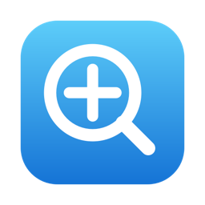

<div align="center">



# XPlain

**Zoom into your screen, draw on it, and record it — with a keystroke.**

A native macOS menu-bar tool for presenters, teachers, and streamers — a
[ZoomIt](https://learn.microsoft.com/en-us/sysinternals/downloads/zoomit) for the Mac.

[](https://github.com/Hinsane5/XPlain/releases/latest)
[](https://github.com/Hinsane5/XPlain/actions/workflows/ci.yml)
[](https://www.apple.com/macos/)
[](https://swift.org)
[](LICENSE)

[**Download**](https://github.com/Hinsane5/XPlain/releases/latest) ·
[Features](#features) · [Hotkeys](#hotkeys) · [Build from source](#build-from-source) · [Docs](#documentation)

</div>

---

## Features

- **Zoom** — freeze and magnify the screen; scroll or `↑`/`↓` to change the zoom
  level, pan by moving the mouse, and **just left-drag to start drawing** on the
  magnified view.
- **Draw & annotate** — six pen colors, a highlighter, shapes (line, rectangle,
  ellipse, arrow), a text tool, and whiteboard / blackboard backdrops, with full
  undo/redo. Copy (`⌘C`) or save (`⌘S`) the annotated result as a PNG.
- **LiveZoom** — a continuously-updating magnifier you keep working *through*
  (click-through); scroll to change the zoom level while you demo.
- **Record** — H.264 `.mp4` to `~/Movies/XPlain`: full-screen or a drag-selected
  region, with optional **system audio** and **microphone** tracks. Recording runs
  in the background, so your zoom and annotations are captured too. A menu-bar
  indicator shows a red dot and elapsed time while recording.
- **Configurable** — a Settings window to rebind every hotkey (with conflict
  warnings), tune zoom/pen/recording defaults, choose the target display, and
  launch XPlain at login.

Everything is a menu-bar agent — no Dock icon, no window clutter.

## Install

1. Download **`XPlain.dmg`** from the [latest release](https://github.com/Hinsane5/XPlain/releases/latest).
2. Open the `.dmg` and drag **XPlain** into **Applications**.
3. Because this build isn't notarized yet (see [note below](#a-note-on-notarization)),
   **right-click XPlain.app ▸ Open** the first time and confirm **Open** — a normal
   double-click is blocked once by Gatekeeper.
4. Grant **Screen Recording** permission when prompted (System Settings ▸ Privacy &
   Security ▸ Screen Recording), then relaunch. The first-run window walks you
   through it.

**Requirements:** macOS 14 (Sonoma) or newer.

## Hotkeys

All hotkeys are configurable in **Settings ▸ Hotkeys**. Defaults:

| Mode | Hotkey | What it does |
|------|--------|--------------|
| **Zoom** | `⌘⌃Z` | Freeze and magnify; scroll / `↑↓` to zoom, left-drag to draw. |
| **Draw** | `⌘⌃D` | Annotate with pens, shapes, arrows, highlighter, and text. |
| **LiveZoom** | `⌘⌃L` | Magnify while the screen stays live and clickable. |
| **Record** | `⌘⌃R` | Start/stop recording (annotations included) to an `.mp4`. |

Press **Esc** (or right-click) to leave a mode; press a mode's hotkey again to toggle it off.

## Build from source

```bash
# Requires Xcode 15+ on macOS 14+.
git clone https://github.com/Hinsane5/XPlain.git && cd XPlain
open XPlain.xcodeproj      # then Product ▸ Run
```

The Xcode project is generated from [`project.yml`](project.yml) with
[XcodeGen](https://github.com/yonaskolb/XcodeGen); after editing it, run
`./scripts/generate-project.sh`. Build a distributable disk image with
`./scripts/build-dmg.sh`.

Run the validation gates before declaring a change done:

```bash
swiftlint --strict
swift-format lint --recursive Sources Tests
xcodebuild -scheme XPlain -destination 'platform=macOS' build test
```

## Documentation

| Doc | What's in it |
|-----|--------------|
| [docs/spec.md](docs/spec.md) | Functional spec — every mode, hotkey, and behavior. |
| [docs/core.md](docs/core.md) | Architecture, components, and the state machine. |
| [docs/plan.md](docs/plan.md) | Phased build roadmap. |
| [docs/backlog.md](docs/backlog.md) | Granular numbered task tracker. |
| [docs/testing.md](docs/testing.md) | Test strategy and definition of done. |
| [docs/security.md](docs/security.md) | Permissions, privacy, signing & notarization. |
| [AGENTS.md](AGENTS.md) | Guide for AI coding agents working in this repo. |

## Privacy

Everything XPlain captures stays **on your device**. No accounts, no servers, no
telemetry. It is not sandboxed (that's what lets it capture the whole screen) and is
distributed outside the App Store. See [docs/security.md](docs/security.md).

## A note on notarization

The current release is **signed but not notarized** — it's built with a free
personal Apple Development certificate rather than a paid Developer ID. It runs
fine; macOS Gatekeeper just asks you to confirm on first launch (right-click ▸
Open). The full notarization pipeline is scripted and ready in
[`scripts/notarize.sh`](scripts/notarize.sh) for whenever a Developer ID is
available.

## Contributing

Contributions are welcome — see [CONTRIBUTING.md](CONTRIBUTING.md). In short: open an
issue to discuss non-trivial changes, keep the validation gates green, and follow the
test-first workflow described there.

## License

[MIT](LICENSE) © 2026 Howard Goh.

---

<sub>XPlain is an independent project and is not affiliated with or endorsed by
Microsoft or Sysinternals. "ZoomIt" is referenced only to describe the kind of tool
this is.</sub>
